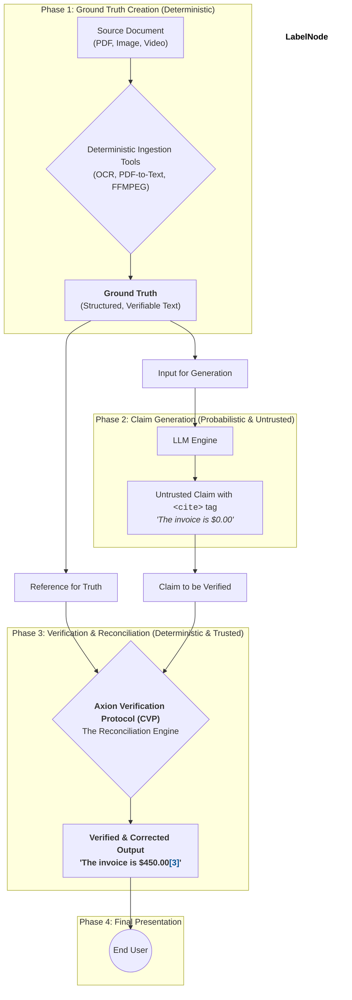

   
  <h1 align="center">Axion</h1>
  

    The Standard for Verifiable AI
  

  

    
    
    
    
  

---

## The Problem: The Crisis of Trust in AI

Generative AI holds immense promise, but its utility is critically undermined by a single, pervasive flaw: **hallucination**. An AI that confidently presents unverified or fabricated information is not just unhelpful; it's a liability. As AI becomes more integrated into high-stakes domains like healthcare, finance, and law, an unverified answer is an unacceptable risk that erodes trust and hinders adoption.

## The Solution: The Axion Standard

**Axion** is an open standard and verification protocol designed to ground generative AI in objective reality.

Instead of treating the AI's output as an opaque, probabilistic black box, Axion provides a framework for making AI claims **transparent, auditable, and deterministically verifiable** against source documents. This repository is the future home for the documentation, specifications, and reference implementations of the Axion Standard.

## The Three Concepts of Verification

The Axion Standard is built on a foundation of three core concepts, which are applied in sequence to any AI-generated claim.

### 1. Does it exist? (Existence Verification)
This is the first and most fundamental check, designed to combat blatant hallucinations. The protocol uses deterministic tools (like literal text search) to answer a simple question: can the source for this claim be found in the provided content? This provides **Verifiable Certainty**.

### 2. Is the prediction in good faith? (Contextual Integrity)
A claim can be factually present but contextually wrong. This concept combats subtle hallucinations by analyzing the context of the verified information. For example, if a medical record from 10 years ago states a patient is "age 40," a good faith presentation would be "age 50," not "age 40." This ensures **Principled Context**.

### 3. Can the prediction be interpreted in bad faith? (Adversarial Resilience)
This final check addresses ambiguity that could be exploited through error or malice. For example, a date like "12/01/00" can be interpreted differently in the US vs. Europe. The protocol flags these ambiguities, which are then resolved and noted for user transparency. This provides an additional layer of **Principled Context** and robustness.

## How It Works: Visualizing Trust

The process is simple: an AI model generates text with a `<cite>` tag containing source metadata. The Axion Verification Protocol (CVP) then independently validates this claim against the source. The CVP corrects the text if necessary and renders the final, truthful statement with a styled citation marker that transparently indicates the verification status.

### Rendered User Experience:

The final output is always clean and correct. The citation's appearance provides at-a-glance confidence that every claim is verified, while transparently noting the journey.

> According to the file, the patient was admitted on **December 1, 2000[1*]**. The patient, now **aged 50[2*]**, originally presented with acute pharyngitis. The final invoice was **$450.00[3]**.

Progressive disclosure on hover or click reveals the details of any corrections or ambiguities.

*   <strong>[3] Blue</strong>: **Verified.** The claim was a direct, contextually-correct match with the source.
*   <strong>[2*] Blue, with Amber Asterisk</strong>: **Corrected.** The claim's source was found, but the CVP updated the text for contextual accuracy (e.g., calculated a current age). The asterisk invites the user to investigate.
*   <strong>[1*] Blue, with Purple Asterisk</strong>: **Ambiguity Resolved.** The source was ambiguous (e.g., unclear date format), and the CVP resolved it based on established rules. The asterisk invites the user to investigate.

## The Axion Trust Graph: A Chain of Verification

The power of Axion lies in its strict architectural separation between the **probabilistic act of generation** and the **deterministic act of verification**. The LLM's output is never blindly trusted; it is merely a proposal that must be rigorously validated by an independent, deterministic process.

**1. Phase 1: Ground Truth Creation (Deterministic)**
The process begins with trusted, deterministic tools. Any source document (PDF, image, etc.) is converted into a structured, searchable text format. This output is the immutable **Ground Truth**, the single source of fact for the entire system.

**2. Phase 2: Claim Generation (Probabilistic & Untrusted)**
The Ground Truth is fed to the LLM. The LLM's only job is to perform a creative task: generate a human-readable summary and embed the raw `<cite>` tags pointing to what it *believes* is the source. Its output is always treated as an **untrusted claim**.

**3. Phase 3: Verification & Reconciliation (Deterministic & Trusted)**
This is the heart of the standard. The **Axion Verification Protocol (CVP)** acts as an independent reconciliation engine. It receives two critical inputs: the **untrusted claim** from the LLM and the original **Ground Truth** from Phase 1. The CVP deterministically compares the two, applies the Three Concepts of Verification, corrects any errors or contextual inaccuracies, and resolves ambiguities.

**4. Phase 4: Final Presentation**
The text shown to the end user is **always the output of the trusted CVP**, never the raw output from the LLM. The CVP renders the final, corrected statement with the appropriately styled citation marker, ensuring the user only ever interacts with verified information.

## 🛡️ Inherent Resistance to Prompt Injection

This "chain of verification" architecture also provides inherent resilience against **prompt injection attacks.** An attack might trick an LLM into generating a malicious claim. However, the CVP acts as a safety checkpoint. It will independently validate the LLM's claim against the Ground Truth. When the malicious claim inevitably fails this deterministic check, the CVP will either flag it as an error or, better yet, replace it with the correct information. The attack is not only blocked; it's corrected.

## 📜 Project Status: Placeholder Phase

This repository and the Axion Standard are currently in a **pre-alpha, foundational stage.**

*   ✅ The core concepts and technical approach have been defined and validated.
*   ⏳ A formal non-profit Foundation is currently being formed to act as the neutral steward of the standard.
*   📝 The formal specification is in an early draft stage.
*   🌱 This GitHub repository is the designated public home for the standard's future development.

## 🚀 Our Vision & Roadmap

Our goal is to make "Axion Certified" a universal mark of trust and reliability for generative AI.

*   **Phase 1 (Now):** Form the founding members of the Axion Standard Foundation (ASF), consisting of industry leaders in technology and high-stakes domains.
*   **Phase 2:** Publish the v0.1 Draft Specification for public comment and release an open-source reference implementation of the CVP.
*   **Phase 3:** Launch the official "Axion Certified" program and expand the protocol to new data types and use cases.

## Get Involved

This is a ground-floor opportunity to shape the future of trusted AI.

*   **Watch & Star:** Click the "Watch" and "Star" buttons on this repository to get notified of major updates as we move towards a public launch.
*   **Express Interest:** If your organization is interested in becoming a founding member of the Axion Standard Foundation (ASF), please reach out to our formation committee at `contact@Axion-standard.org`.

## Governance

The Axion Standard will be managed by the forthcoming Axion Standard Foundation (ASF), a non-profit organization modeled after successful standards bodies. This ensures neutral, member-driven governance for the benefit of the entire ecosystem.

## License

The documentation and specifications in this repository are and will be licensed under the **Apache 2.0 License**. See the `LICENSE` file for details.
